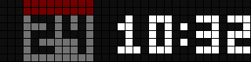
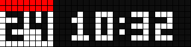
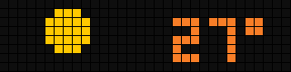

# Ulanzi Weather Clock

A clock for the [Ulanzi TC001](https://www.ulanzi.com/products/ulanzi-pixel-smart-clock-2882) and other 32×8 [AWTRIX NG](https://github.com/Blueforcer/awtrix-ng) panels: time, calendar and an animated weather scene in two designs, written in AWTRIX NG's Berry scripting. No MQTT, no home automation, no cloud account; the panel fetches the weather itself.

[](LICENSE)
[](https://github.com/Blueforcer/awtrix-ng)
[](https://www.buymeacoffee.com/bkahlert)

---



## Features

- **Two designs** — *muted*: the time stands at the right while the calendar and the weather take turns at the left, cross-fading over a dimmed scene; *classic*: calendar and time, then the weather, each wiped in by a sprite. The middle button switches.
- **A scene for every weather** — a sun with a breathing aura, moon and stars, drifting clouds, drizzle, rain, snow, fog, showers and thunder, one per WMO weather code from [Open-Meteo](https://open-meteo.com), no API key.
- **Sprite wipes** — Mario and Luigi, Blinky chasing Pac-Man, a Space Invader, a light beam, Yoshi, Sonic, a Lemming, KITT's scanner and a Metroid carry the classic design from page to page, drawn at random or pinned.
- **Temperature on a colour ramp** — Celsius or Fahrenheit.
- **Demo** — hold the middle button and every scene plays for five seconds.
- **Tested and previewable offline** — the scripts run in a standalone Berry under a stubbed panel API: pixel-exact tests and rendered GIFs, no hardware needed.





## Prerequisites

| What | Needed |
|---|---|
| Panel | Ulanzi TC001, or any 32×8 panel running AWTRIX NG |
| Firmware | [AWTRIX NG](https://github.com/Blueforcer/awtrix-ng) 1.1.2 or later; the hold on the middle button needs 1.1.2 |
| Script heap | the clock takes most of the panel's 96 KB script heap and runs with 35–45 KB of it free (up to 45 KB after a clean boot, about 35 KB after a settings save), so on its own or next to small scripts; see [docs/memory.md](docs/memory.md) |
| Tools | Python 3.11+ for `apply` and `bundle`; [uv](https://docs.astral.sh/uv/) for the generators and the previews |

## Installation

### From the bundle

Download `ulanzi-weather-clock-<version>.zip` from the [releases](https://github.com/bkahlert/ulanzi-weather-clock/releases) or build it with `./bundle`, restore it in the web UI under **System → Restore backup**, and reboot. The archive holds the eight scripts and nothing else; settings, icons and other scripts on the panel stay as they are. Then set your coordinates (below) and, if you like, switch the built-in Time app off.

### With the installer

```sh
git clone https://github.com/bkahlert/ulanzi-weather-clock.git
cd ulanzi-weather-clock
cp .env.example .env      # the panel's address and web UI login
./apply --dry-run         # what would change
./apply                   # system config, settings, scripts, rotation
```

`apply` reads the panel first and writes only the difference, so it is safe to run again after any change; `--only scripts` limits it to the scripts. It also applies [`system.json`](system.json), [`settings.json`](settings.json) and [`apps.json`](apps.json) - hostname, time format, which built-in apps rotate - which you may want to edit first. Details in [docs/operations.md](docs/operations.md).

## Configuration

Every knob is a setting in the web UI under **Apps → ⚙ next to Clock**:

| Setting | Default | |
|---|---|---|
| Design | muted | `muted` or `classic`; the middle button switches too |
| Latitude, Longitude | Berlin | the place whose weather is shown |
| Temperature unit | C | `C` or `F` |
| Weather refresh | 15 min | |
| Calendar shows for, Weather shows for | 12 s, 8 s | the two pages' time on screen |
| Scene animation | 250 ms | time per animation step of the classic weather scene |
| Weather backdrop | 45 % | muted: brightness of the calendar card and of the scene behind the temperature |
| Fade | 3 s | muted: length of the cross-fade between calendar and weather |
| Muted brightness | 65 % | muted: brightness of everything; the light sensor still applies on top |
| Weather comes in with, Calendar comes in with | random | classic: a sprite by name, `random`, or `none` for a hard cut |
| Wipe pace | 90 ms | classic: time per pixel a sprite moves |

Values changed in the web UI stay: `apply` reports them and leaves them alone, and `./apply --reset-config` puts everything back to the defaults. Values that belong to one panel rather than to the script - its coordinates, say - go into `config/<app>.json`, and `apply` writes them whenever they differ:

```json
{ "lat": 52.52, "lon": 13.405 }
```

### Buttons

| Button | |
|---|---|
| Right, left | the next page, the previous page |
| Middle, a press | the other design |
| Middle, held | the demo: every weather scene, five seconds each; a second hold ends it |

## Development

```sh
test/run                   # the offline tests; builds the Berry interpreter on first run
preview/render             # renders preview/*.gif from the scripts
art/generate --write       # weather scene elements → scripts/art.ax
sprites/extract --write    # wipe sprites → scripts/sprites.ax
./bundle                   # dist/ulanzi-weather-clock-<version>.zip
```

The clock is one app, [`clock.ax`](scripts/clock.ax), and seven modules it imports. Why it is built that way, how the wipes and the scenes work: [docs/design.md](docs/design.md). The panel's memory rules that shaped it: [docs/memory.md](docs/memory.md). Flashing, firmware upgrades and the tripwires met along the way: [docs/operations.md](docs/operations.md). Also in the box: [`departures.ax`](scripts/departures.ax), a departures board for Berlin's BVG, switched off by default.

## Credits

- [AWTRIX NG](https://github.com/Blueforcer/awtrix-ng) by Blueforcer: the firmware and its Berry scripting.
- The weather fetch, the temperature colour ramp and the code mapping follow Hank_the_Tank's Hub flow [Weather Script](https://awtrix.de/flow/fGEhP0cZZd6E).
- Four wipe sprites are cut from AWTRIX Hub GIFs; see [sprites/](sprites/).

## License

[MIT](LICENSE)
